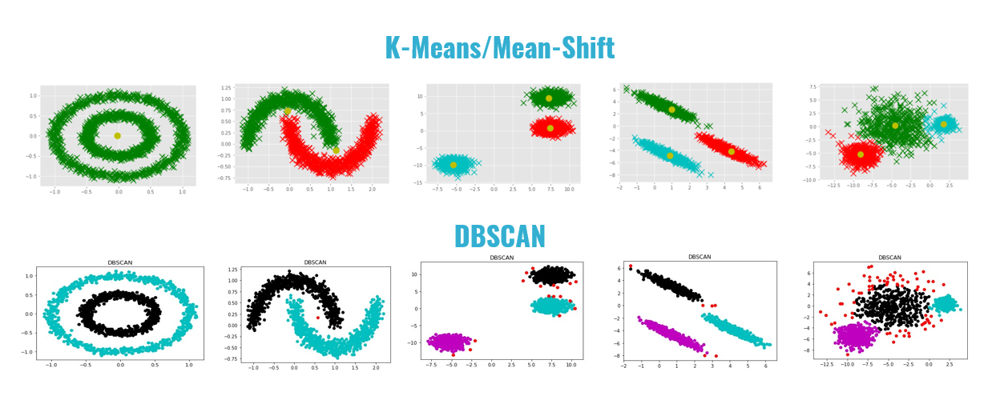

# Clustering_Algorithm_Project_ITI
DBSCAN vs Merging Mean-Shift with K-Means  (Mean shift and K-Means algorithm are two similar clustering algorithms; both of them extract information from data with some kind of mean vector operations.  compare these two algorithms and show a way, with VisuMap software, to combine them to get much better clustering tools.) 

# Project in Master Branch
# Team Members GR3 ITI:							  						                       										                     
 				1- Abdullah Abdelhakeem
        2- Mohamed Mostafa
        3- ElShaimaa Hassan
        4- Mohamed Sebaie
        5- Osama Ahmed
        6- Lamiaa Omar													                       	
# Date: 
        - 13 July 2021																                         
# Version: 
        - 0.0.1
        
# About 
        - Clustering
          - K-Means Algorithm
          - Mean Shift Algorithm
          - Merge Between K-Mean and  Mean Shift
          - DBSCAN Algorithm

<h1>Image Projects</h1>
<h3>K-Means And Mean-Shift</h3>
<ol>
  <ul></ul>
</ol>
<ol>
  <ul></ul>
</ol>
<ol>
  <ul></ul>
</ol>
<ol>
  <ul></ul>
</ol>
<ol>
  <ul></ul>
</ol>
<ol>
  <ul></ul>
</ol>
<ol>
  <ul></ul>
</ol>
<ol>
  <ul></ul>
</ol>
V
<ol>
  <ul></ul>
</ol>
<ol>
  <ul></ul>
</ol>
<ol>
  <ul></ul>
</ol>
<ol>
  <ul></ul>
</ol>
<ol>
  <ul></ul>
</ol>
<ol>
  <ul></ul>
</ol>
<ol>
  <ul></ul>
</ol>
